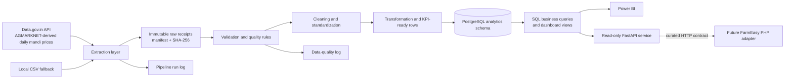

# Architecture

## Layer responsibilities

| Layer | Responsibility | Must not do |
| --- | --- | --- |
| Extraction | Retrieve pages/files, preserve bytes and source metadata | Apply business transformations |
| Raw storage | Retain replayable source receipts and manifests | Store secrets or large data in Git |
| Validation | Check schema/ranges and create auditable issues | Silently discard bad values |
| Transformation | Canonicalize names, calculate hashes and quality flags | Directly serve a UI |
| Load | Upsert dimensions/facts and record runs | Modify FarmEasy's MySQL tables |
| SQL/views | Govern reusable KPIs and ranking logic | Embed API credentials |
| API | Apply query validation and pagination to read models | Run ETL in request handlers |

## Separation from FarmEasy

The legacy PHP site remains an operational marketplace on MySQL. The analytics
module uses PostgreSQL under its own `analytics` schema and should be granted a
pipeline write role plus a separate read-only API/BI role. This avoids load and
security coupling while letting future PHP pages consume curated market insight.
