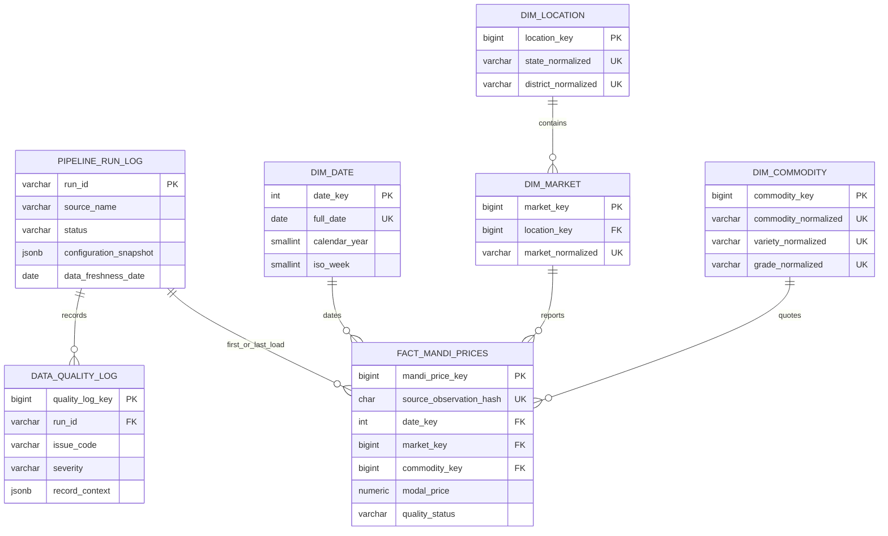

# PostgreSQL warehouse schema

The analytics warehouse is a separate PostgreSQL database. It must never be
applied to `farmeasy.sql` or the legacy PHP application's MySQL/MariaDB
database. The core DDL lives in
[`../sql/schema/001_analytics_schema.sql`](../sql/schema/001_analytics_schema.sql).

## Logical model



The price fact's grain is one official source observation for a date, market,
commodity, variety, and grade. State and district reach the fact through market
and location. The source observation hash identifies that grain; a content hash
detects whether a later re-run contains a corrected version of it.

## Tables and purpose

| Table | Why it exists |
| --- | --- |
| `analytics.dim_date` | Enables stable daily, weekly, monthly, and quarterly grouping without repeating calendar logic in every query. |
| `analytics.dim_location` | Deduplicates standardized state/district labels and keeps their natural hierarchy explicit. |
| `analytics.dim_market` | Separates a mandi from its district; market names may recur in different districts. |
| `analytics.dim_commodity` | Stores commodity plus optional variety and grade at the exact quotation grain. Missing optional values become `Unknown` only in this dimension, never fabricated in raw data. |
| `analytics.fact_mandi_prices` | Holds validated price observations and their supplied quality state. `source_name + source_observation_hash` is unique, making repeated load attempts idempotent. |
| `analytics.pipeline_run_log` | Records operational counts, freshness, status, safe configuration snapshot, and the raw-manifest path for each run. |
| `analytics.data_quality_log` | Persists every error or warning, including source-row context, so dashboards can expose data trust alongside prices. |

`analytics.fact_market_arrivals` is deliberately absent from the core schema.
The optional DDL is documented separately and must not be applied until a
verified government source supplies both arrival quantity and unit.

## Index rationale

| Index | Query pattern it supports |
| --- | --- |
| `idx_fact_mandi_prices_commodity_date` | Commodity trend charts, moving averages, and date-range slicers. |
| `idx_fact_mandi_prices_market_date` | Latest-price, mandi comparison, and market-specific trends. |
| `idx_fact_mandi_prices_date_market` | Daily market comparisons and active-mandi counts. |
| `idx_fact_mandi_prices_review_status` | Fast retrieval of warning/suspicious facts for risk and data-quality pages. |
| `idx_dim_market_location` | State/district-to-mandi drill paths. |
| `idx_pipeline_run_log_status_started` | Latest successful run and operational-monitoring queries. |
| `idx_data_quality_log_run` | Quality-page aggregations by run, severity, and issue code. |
| `idx_data_quality_log_observation` | Trace a warning back to a source observation where a hash is available. |

## Loading behavior

`load-csv` and `load-api` first preserve the raw source and produce local
quality artifacts. They then use parameterized PostgreSQL `INSERT ... ON
CONFLICT` statements in a transaction:

1. Start or reset the pipeline-run log.
2. Seed every calendar day between the first and last observed quote into the
   date dimension, then upsert date, location, market, and commodity dimensions.
3. Insert a price fact, or update it only when its content or quality state has
   changed.
4. Insert quality issues using a per-run issue hash, so retries do not duplicate
   audit entries.
5. Mark the run successful; failures receive a safe error classification rather
   than a credential-bearing connection error.

```powershell
# CSV fallback, full pipeline to PostgreSQL
\.venv\Scripts\farmeasy-mandi.exe load-csv .\downloads\mandi-prices.csv `
  --run-id csv-20260908 --reference-date 2026-09-08

# Official API, full pipeline to PostgreSQL
\.venv\Scripts\farmeasy-mandi.exe load-api `
  --state Karnataka --reference-date 2026-09-08
```

Both loading commands require `FARMEASY_ANALYTICS_DATABASE_URL`. Use
`validate-csv` or `validate-api` for an offline review that intentionally stops
before PostgreSQL.

For an interview: “The marketplace uses an operational model; reporting uses a
separate star schema. I retained immutable source lineage and made the source
observation hash the warehouse idempotency key, so repeat API pages cannot
inflate price history.”
